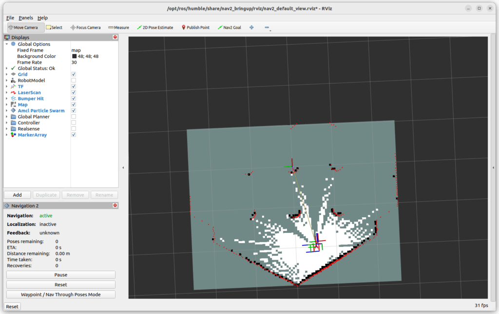
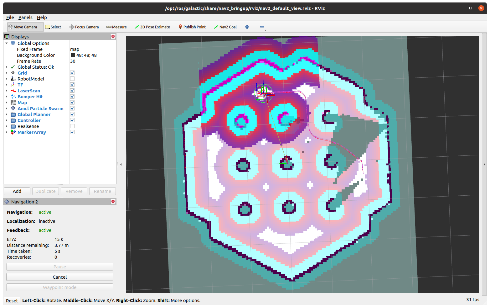

# utbots_navigation


**This stack contains packages related to environment mapping and autonomous navigation, such as:**

- **utbots_nav** - Our setup for mapping and navigation
- **utbots_nav_utils** - Some tests and tools for navigation
- **hoverboard_driver_hestia** - ROS2 Driver for the hoverboard
- **mpu6050driver** - ROS2 Driver for the mpu6050 IMU sensor

## Getting started

### Installation

```bash
cd <ros2_ws>/src
git clone https://github.com/UtBotsAtHome-UTFPR/utbots_navigation.git
git checkout ros2-dev
cd ../
```

### Dependencies

This stacks utilizes [rplidar_ros](https://github.com/Slamtec/rplidar_ros/tree/ros2) as the LIDAR driver and [navigation2](https://github.com/ros-navigation/navigation2) for navigation and mapping algorithms integration to ROS2. Teleop keyboard is also useful for a person moving the robot. Install them with:

```bash
sudo apt install ros-humble-rplidar-ros ros-humble-navigation2 ros‑humble‑teleop‑twist‑keyboard
``` 

For the MPU6050 IMU integration, you must install and setup microROS (**OBS**: Not currently being used):

```bash
# Source the ROS 2 installation
source /opt/ros/$ROS_DISTRO/setup.bash

# Download the micro-ROS tools
cd <ros2_ws>
git clone -b $ROS_DISTRO https://github.com/micro-ROS/micro_ros_setup.git src/micro_ros_setup

# Update dependencies
sudo apt update && rosdep update
rosdep install --from-paths src --ignore-src -y

# Build micro-ROS tools and source them
colcon build
source install/local_setup.bash

# Download and build micro-ROS-Agent packages
ros2 run micro_ros_setup create_agent_ws.sh
ros2 run micro_ros_setup build_agent.sh
source install/local_setup.bash
```

### Building

```bash
cd <ros2_ws>
colcon build
```

## Running

### Initial setup
You must connect the computer to a custom firmware flashed hoverboard board through serial communication. That means using a Serial-USB converter connecting the board to the computer. For instructions on how to connect the serial pins to the converter, refer to the custom firmware documentation on the [Right Sideboard pins](https://github.com/EFeru/hoverboard-firmware-hack-FOC?tab=readme-ov-file#hardware). To test connection, turn the hoverboard on and run:
```bash
ros2 launch utbots_nav hoverboard.launch.py
```
**OBS1**: We currently use a Serial converter with the device ID `/dev/serial/by-id/usb-Prolific_Technology_Inc._USB-Serial_Controller-if00-port0`, if you use other converter, you must change to its ID in `./hoverboard-driver-hestia/description/ros2_control/hoverboard_driver.ros2_control.xacro`

**OBS2**: If the wheels are not properly connected to the hoverboard board, some problems may arise and the driver won´t work as it should. Make sure the connections are adequate by consulting the [documentation](https://github.com/EFeru/hoverboard-firmware-hack-FOC?tab=readme-ov-file#hardware).

### Mapping procedure
For mapping an environment, before starting you must position the robot in the place you consider a good initial pose, because it will be defined as the origin of the map (the [0,0,0] coordinate) and every other place will be relative to it. Then you can launch the mapping with, you should see RViz popping up and the LIDAR data being drawn in a map with obstacles points in black and clear space as grey: 

```bash
export BASE_MODEL=hestia
ros2 launch utbots_nav map.launch.py    ## Launch all mapping packages (Gmapping)
```



You should move the robot through the environment and the simplest way is to use the keyboard as a controller:
```bash
ros2 run teleop_twist_keyboard teleop_twist_keyboard
```
Drive the robot slowly and make sure to cover all areas without any holes in the map. It is important to know the LIDAR will have problems with thin obstacles such as chair legs and glass surfaces, this obstacles may need further manual addition in softwares like GIMP (in the map pgm file) or the use of [Keepout Filters](https://docs.nav2.org/tutorials/docs/navigation2_with_keepout_filter.html).

When you think the map is good, you should save it with:
```bash
ros2 run nav2_map_server map_saver_cli -f <map_name>
```
It should generate two files, a <map_name>.pgm with a drawing of the map and a <map_name>.yaml with some parameters. Once you verify both files are created, you can shutdown the mapping launch.

### Navigation procedure
For navigating in a mapped environment you must first have its map files (.pgm and .yaml) to run the navigation system with AMCL:
```bash
export BASE_MODEL=hestia
ros2 launch utbots_nav nav.launch.py  map:="<map_path>"  ## Launch all navigation packages (AMCL)
```
You should see RViz pop up in your screen. To initiate autonomous localization and navigation, you must first set the robot initial pose estimate (where you think it is and where you think its oriented to). If everything launched correctly, you should see the lidar data being drawn in real time with color in RViz and then be able to set Navigation Goals.



#### Save waypoints with a name

A node in utbots_nav_utils implements a server that saves the robot current pose (/amcl_pose) in a file respective to the map name present in the /map_server/yaml_filename/parameter. The file will be created inside '<ros2-ws>/src/utbots_navigation/utbots_nav/map/' as '{file_name}_waypoints.yaml' (map.yaml -> map_waypoints.yaml)

First run the node with the service:
```bash
ros2 run utbots_nav_utils save_waypoint_service
```

Drive the robot to the place and orientation you want to save (it is preferred to set a Navigation Goal in RViz to make sure the position in the map is correct) and run the service to save the <waypoint_name> waypoint:
```bash
ros2 service call /utbots/utbots_nav/save_waypoint utbots_srvs/srv/SetString \
"{waypoint: {data: '<waypoint_name>'}}" # like "{waypoint: {data: 'bathroom'}}"
```
---

### Launch parameters
Both navigation and mapping have parameters that can be set when launching them:
```bash
ros2 launch utbots_nav map.launch.py map_dir:="<map_file_path>" input_scan_topic:="topic_name" filtered_scan_topic:="filtered_laser_topic_name" lidar_port:="<lidar_port>" use_imu:=<True or False> imu_port:=<imu_port>"

ros2 launch utbots_nav nav.launch.py map_dir:="<map_file_path>" input_scan_topic:="topic_name" filtered_scan_topic:="filtered_laser_topic_name" lidar_port:="<lidar_port>" use_imu:=<True or False> imu_port:="<imu_port>"
```

### Changing parameters and calibrating

- `./hoverboard-driver-hestia/description/urdf/diffbot_description.urdf.xacro`: hoverboard mobile base static tf distances and frames 
- `./hoverboard-driver-hestia/description/ros2_control/hoverboard_driver.ros2_control.xacro`: hoverboard hardware min and max velocities permitted for the wheels, radius of wheels
- `./utbots_nav/param/hoverboard_controllers.yaml`: controller software limitations for mobile base dimensions, wheel separation, frames and min max velocities and acceleration of the robot (not the same as the wheels, because of the distance of wheels to the center of rotation)
- `./hoverboard-driver-hestia/bringup/config/box_laser_filter.yaml`: parameter file for configuring the area the lidar sensor will ignore so it doesn't percieve the robot as an obstacle
- `./utbots_nav/param/hestia_nav.yaml`: navigation parameters (globalcostmap, localcostmap, footprint, AMCL, etc.)
- `./utbots_nav/param/hestia_map.yaml`: mapping parameters (globalcostmap, localcostmap, footprint, etc.)

**OBS**: some parameters may be repeated in multiple files, the parameters from hestia_nav and hestia_map will override repeated ones when running navigation or mapping

## Overview

### utbots_nav

- Setup for launching all needed components for mapping and navigation
- Launch ROS2 Driver for RPLidar sensors
- Launch ROS2 Driver for Hoverboard firmware
- Set custom navigation and mapping parameters
- Configure navigation and mapping filters

#### Running

Test RPLIDAR A1:
```bash
ros2 launch utbots_nav rplidar.launch.py
```

Test hoverboard firmware:
```bash
ros2 launch utbots_nav hoverboard.launch.py
```

Mapping and navigation procedures, and parameter configuring is detailed above. For further documentation, see [navigation2](https://docs.nav2.org/index.html) and [rplidar_ros](https://github.com/Slamtec/rplidar_ros).

---
### utbots_nav_utils

See the README in `./utbots_nav_utils`

---

### hoverboard-driver-hestia

- ROS2 Driver for the hoverboard with [custom firmware](https://github.com/EFeru/hoverboard-firmware-hack-FOC?tab=readme-ov-file)
- Implemented with ros2_control

#### Running
Without custom parameters you can run: 
```
ros2 launch hoverboard_driver diffbot.launch.py
```

---

### mpu6050driver

**OBS**: Not currently being used

#### Installation
Refer to the [tutorial on microROS with ESP32](https://technologiehub.at/project-posts/micro-ros-on-esp32-tutorial/) and [PlatformIO IDE](https://docs.platformio.org/en/latest/integration/ide/vscode.html).

-  ESP32 board .cpp code for MPU6050 IMU read through I2C port and serial communication with ROS2 using the microROS package

#### Running
Connect the MPU6050 board pins like the following: VCC to 3.3V, GND to GND, SCL to G22 and SDA to G21. 

Flash the firmware in `mpu6050driver/src/main.cpp` to the board, e.g. using the PlatformIO interface in VSCode with the .ini file, selecting the the port and run the following:

```bash
ros2 run micro_ros_agent micro_ros_agent serial --dev <port>
```

You should see a topic called `/imu_info_topic` in `ros2 topic list`.
